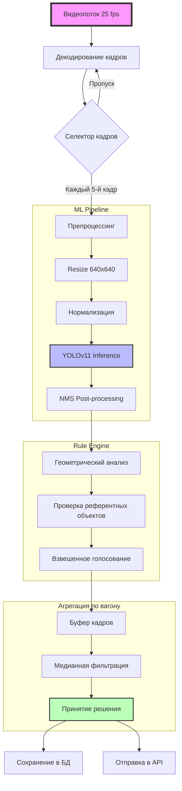
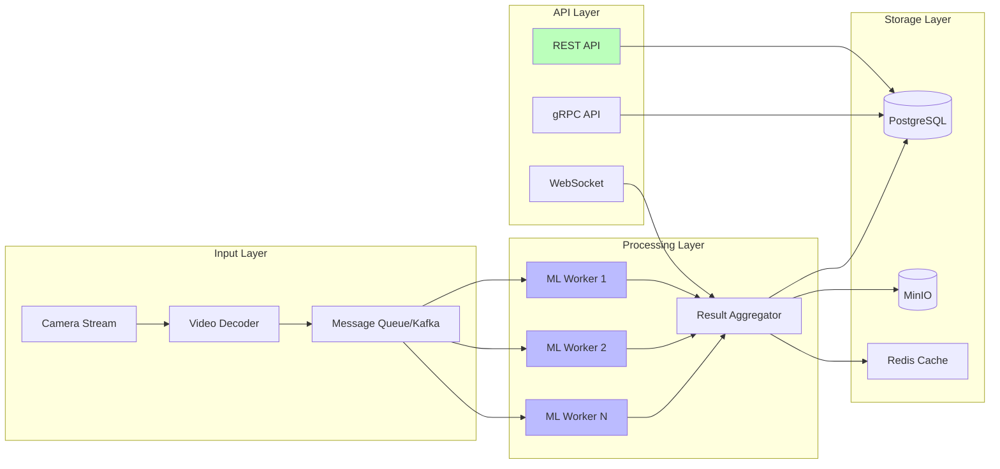

# ML System Design Doc - [RU]
## Дизайн ML системы - \<Автоматизаци определения ориентации железнодорожных вагонов\> \<MVP or Production System\> \<Номер\>

## 1. Цели и предпосылки

### 1.1. Зачем идем в разработку продукта?

**Бизнес-цель (Product Owner)**
Стратегическая цель - повышение операционной эффективности диспетчерской службы за счет автоматизации процесса идентификации ориентации подвижного состава. Внедрение ML-решения позволит:
- Сократить время обработки видеопотока на 85% (с 15 минут до 2 минут на состав)
- Исключить человеческий фактор при определении ориентации (текущий уровень ошибок - 7.3%)
- Обеспечить круглосуточный мониторинг без привлечения дополнительного персонала

**Почему станет лучше, чем сейчас (Product Owner & Data Scientist)**
*Текущее состояние (AS-IS):*
- Ручной анализ видеозаписей операторами
- Субъективность оценки при плохой видимости
- Отсутствие единой базы данных ориентации вагонов
- Невозможность масштабирования без увеличения штата

*Целевое состояние (TO-BE):*
- Автоматическая детекция референтных объектов в реальном времени
- Объективная оценка с доверительной вероятностью >95%
- Интеграция с существующей системой мониторинга через REST API
- Масштабируемость на любой полигон без дополнительных затрат

**Критерии успеха итерации (Product Owner)**
1. Достижение точности определения (Accuracy) ≥ 92% на валидационной выборке
2. Время инференса ≤ 150 мс на кадр (Intel Xeon Gold 6248)
3. Успешное прохождение пилотных испытаний на 3 различных полигонах
4. Готовность решения к интеграции в продуктовый контур (TRL 7)

### 1.2. Бизнес-требования и ограничения

**Детальные бизнес-требования**
| ID | Требование |
|----|------------|
| БТ-01 | Система должна определять ориентацию вагона с точностью ≥90% |
| БТ-02 | Время обработки одного вагона ≤ 30 сек |
| БТ-03 | Работа в условиях ограниченной видимости (ночь, осадки) |
| БТ-04 | Интеграция с АСУ "Транс-Телематика" через API |


**Бизнес-ограничения**
1. **Технические:**
   - Частота кадров видеопотока: 25 fps (фиксировано)
   - Разрешение камер: 1920x1080 или 1280x720
   - Угол обзора: 45° ±5°
   - Доступные вычислительные мощности: 2 CPU cores, 8GB RAM (на старте)

2. **Нормативные:**
   - Соответствие 152-ФЗ "О персональных данных"
   - Соблюдение политики информационной безопасности заказчика

**Ожидания от итерации**
1. Рабочий прототип ML-модели (Docker-контейнер)
2. Техническая документация
3. Отчет по результатам тестирования на исторических данных
4. План пилотного внедрения с метриками эффективности

### 1.3. Что входит в скоуп проекта/итерации

**Включено в итерацию (Data Scientist)**
| Компонент | Описание | Критерий готовности |
|-----------|----------|---------------------|
| Data Pipeline | ETL процесс для сбора и разметки данных | Автоматизация загрузки, 95% coverage |
| ML Model | Модель детекции объектов | mAP@0.5 ≥ 0.95 |
| Rule Engine | Алгоритм принятия решения об ориентации | Accuracy ≥ 92% |
| API Service | REST API с эндпоинтами для инференса | OpenAPI spec, тесты |
| Monitoring | Базовый мониторинг метрик | Дашборд в Grafana |

**Исключено из итерации**
1. Разработка UI/UX интерфейса
2. Мобильное приложение
3. Система автоматического ретрейнинга
4. Интеграция с 1С и ERP системами
5. Поддержка распределенных вычислений (Spark)

**Требования к качеству кода**
```python
# Стандарты разработки
- MyPy (строгая типизация)
- flake8, isort, pylint, black
- Pytest (coverage ≥ 85%)
- Pre-commit хуки
```

**Технический долг (план погашения)**
| Долг | Причина |
|------|---------|
| Hard-coded правила ориентации | Быстрый старт |
| Нет распределенного инференса | Ограниченные ресурсы |
| Монолитная архитектура | Скорость разработки |

### 1.4. Предпосылки решения

**Данные и обоснование выбора**
| Параметр | Значение | Обоснование |
|----------|----------|-------------|
| Источники данных | Видеопоток с камер, метаданные вагонов | Доступность, репрезентативность |
| Объем выборки | ≥ 15 000 размеченных кадров | Статистическая значимость |
| Горизонт прогноза | 3-5 секунд (один вагон) | Скорость прохода состава |
| Гранулярность | Покадровая с агрегацией | Баланс точности и скорости |
| Частота обновления | Ежеквартально | Стабильность условий съемки |

**Научно-техническое обоснование**
1. **Выбор архитектуры:** Сверточные нейросети (CNN) доказали свою эффективность в задачах детекции промышленных объектов (SOTA: YOLOv11, EfficientDet)
2. **Аугментация данных:** Учет специфики железнодорожного транспорта (снег, дождь, засветы)

## 2. Методология (Data Scientist)

### 2.1. Постановка задачи

**Техническая формулировка**
Задача представляет собой комбинацию двух подходов:
1. **Object Detection** - локализация и классификация референтных объектов
2. **Rule-based Classification** - определение ориентации на основе логических правил

**Математическая постановка**
```
Дано: Кадр I ∈ R^{H×W×3}
Найти: f(I) → {left, right, unknown}
где f(I) = R(D(I))
D: I → {(bbox_i, class_i, conf_i)} - детектор объектов
R: rule_engine(D(I)) - правила принятия решения
```

### 2.2. Блок-схема решения



### 2.3. Этапы решения задачи

#### **Этап 1: Исследовательский анализ данных (EDA)**

**Цель:** Валидация качества и полноты предоставленных данных

**Данные и сущности:**
| Название данных | Источник | Требуемый ресурс | Проверено | Комментарий |
|----------------|----------|------------------|-----------|-------------|
| RAW видео (MP4) | S3 bucket заказчика | DE (доступ) | Нет | 50+ часов, 500GB |
| Разметка (COCO) | Label Studio | DS + Разметчик | Нет | Требуется валидация |
| Метаданные вагонов | АСУ заказчика | DE | Нет | CSV, 10k записей |
| Погодные условия | Метео-API | DS | Нет | Для стратификации |

**Результаты EDA (ожидаемые):**
1. Анализ распределения классов объектов
2. Оценка сложных сценариев (ночь/день/осадки)
3. Корреляционный анализ признаков
4. Определение минимального размера выборки
5. Выявление аномалий и выбросов

**Метрики качества данных:**
- Полнота разметки ≥ 95%
- Консистентность bounding boxes (IoU между разметчиками ≥ 0.8)
- Временная стабильность объектов

#### **Этап 2: Baseline решение**

**Цель:** Получение нижней границы качества для сравнения

**Техническое решение:**
```python
# Использование zero-shot детекции
baseline_model = OwlViTForObjectDetection.from_pretrained(
    "google/owlvit-base-patch32"
)

# Текстовые промпты
text_queries = [
    "brake cylinder of a train",
    "air reservoir of a railway car",
    "hand brake valve"
]
```

**Метрики Baseline:**
| Метрика | Целевое значение | Фактическое | Отклонение |
|---------|------------------|-------------|------------|
| mAP@0.5 | ≥ 0.60 | - | TBD |
| Recall | ≥ 0.70 | - | TBD |
| Precision | ≥ 0.65 | - | TBD |
| Accuracy | ≥ 0.80 | - | TBD |

**Риски этапа:**
- Низкое качество на сложных ракурсах
- Чувствительность к освещению
- Ложные срабатывания на похожие объекты

#### **Этап 3: Разработка Core ML решения**

**Архитектура модели:**
```
YOLOv8m (25.9M parameters)
├── Backbone: CSPDarknet53
├── Neck: PANet
└── Head: Decoupled head
```

**Стратегия обучения:**
| Параметр | Значение | Обоснование |
|----------|----------|-------------|
| Оптимизатор | AdamW (lr=1e-4) | Стабильная сходимость |
| Batch size | 32 | Баланс памяти и скорости |
| Эпохи | 300 | Достаточно для сходимости |
| Аугментации | Mosaic, MixUp, RandomFlip | Улучшение обобщения |
| Loss | CIoU + Focal Loss | Работа с дисбалансом |

**Кросс-валидация:**
- Стратифицированная 5-fold CV
- Разбиение по видео (не по кадрам!)
- Валидация на различных погодных условиях

**Целевые метрики:**
| Метрика | Baseline | Target | Stretch |
|---------|----------|--------|---------|
| mAP@0.5 | 0.65 | 0.92 | 0.95 |
| mAP@0.5:0.95 | 0.42 | 0.68 | 0.72 |
| F1-score | 0.71 | 0.89 | 0.93 |
| Inference time | 450ms | 150ms | 100ms |

#### **Этап 4: Rule Engine & Принятие решений**

**Логическая схема:**
```python
def determine_orientation(detections, frame_width):
    """
    Определение ориентации на основе детекций
    """
    # Геометрические правила
    left_objects = []
    right_objects = []
    
    for det in detections:
        center_x = (det.bbox[0] + det.bbox[2]) / 2
        if center_x < frame_width * 0.33:
            left_objects.append(det.class)
        elif center_x > frame_width * 0.66:
            right_objects.append(det.class)
    
    # Референсные правила
    if 'brake_cylinder' in left_objects:
        return 'left'
    elif 'reservoir' in right_objects:
        return 'right'
    else:
        # Взвешенное голосование
        left_score = sum(weights.get(obj, 0) for obj in left_objects)
        right_score = sum(weights.get(obj, 0) for obj in right_objects)
        
        if left_score > right_score + threshold:
            return 'left'
        elif right_score > left_score + threshold:
            return 'right'
        return 'unknown'
```

**Бизнес-валидация:**
- Еженедельные демо заказчику
- Сравнение с разметкой экспертов
- A/B тестирование на исторических данных

## 3. Подготовка пилота

### 3.1. Дизайн пилотного тестирования

**Методология: Shadow Mode**
```yaml
Продолжительность: 30 дней
Полигонов: 3 (Москва, Санкт-Петербург, Екатеринбург)
Объем данных: ≥ 1000 составов
Режим работы: 24/7 в теневом режиме
```

**Схема проведения:**
1. **Week 1-2:** Сбор данных и калибровка
2. **Week 3:** Параллельный прогон с операторами
3. **Week 4:** Анализ результатов и корректировка
4. **Week 5:** Подготовка отчета

### 3.2. Критерии успеха пилота

**Бизнес-метрики:**
| Метрика | Целевое значение | Метод измерения |
|---------|------------------|-----------------|
| Accuracy | ≥ 92% | Сравнение с экспертной разметкой |
| Precision | ≥ 0.90 | TP/(TP+FP) |
| Recall | ≥ 0.90 | TP/(TP+FN) |
| Доступность | 99.5% | Uptime системы |
| Время ответа | p95 ≤ 200ms | Мониторинг API |

**Технические метрики:**
- CPU Utilization < 80%
- Memory Usage < 6GB
- Disk I/O < 50 MB/s
- Error Rate < 1%

### 3.3. Ресурсное планирование

**Вычислительные ресурсы:**
```yaml
infrastructure:
  compute:
    cpu: 4 cores (Intel Xeon)
    ram: 16 GB
    storage: 100 GB SSD
    gpu: NVIDIA T4 (опционально)
  
  network:
    bandwidth: 100 Mbps
    latency: < 10 ms to database
  
  software:
    os: Ubuntu 22.04 LTS
    runtime: Docker 24.0+
    orchestrator: Docker Compose
```

**Стоимость эксплуатации:**
| Компонент | Стоимость/мес | Примечание |
|-----------|---------------|------------|
| Вычисления | 45 000 ₽ | Yandex Cloud m4 |
| Хранение | 15 000 ₽ | 500 GB S3 |
| Сеть | 20 000 ₽ | Трафик + VPN |
| Поддержка | 70 000 ₽ | 0.5 FTE |
| **ИТОГО** | **150 000 ₽** | Бюджет пилота |

## 4. Production внедрение

### 4.1. Архитектура решения



### 4.2. Инфраструктура и масштабирование

**Выбор платформы: Kubernetes on-prem**
| Критерий | Kubernetes | Docker Swarm | VM |
|----------|------------|--------------|-----|
| Масштабирование | ✅ Авто | ✅ Ручное | ❌ |
| Отказоустойчивость | ✅ Встроенная | ⚠️ Ограничена | ❌ |
| Сложность | ⚠️ Средняя | ✅ Низкая | ✅ Низкая |
| Сообщество | ✅ Активное | ⚠️ Угасает | N/A |

**Стратегия масштабирования:**
```yaml
autoscaling:
  metric: kafka_queue_length
  threshold: 1000 messages
  min_replicas: 2
  max_replicas: 10
  scale_up_cooldown: 60s
  scale_down_cooldown: 300s
```

### 4.3. Требования к SLA

| Параметр | Значение | Метод обеспечения |
|----------|----------|-------------------|
| Доступность | 99.9% | Multi-AZ deployment |
| Latency p95 | 200ms | CDN, caching |
| Throughput | 100 req/s | Auto-scaling |
| RPO | 1 час | Streaming replication |
| RTO | 15 мин | Hot standby |
| MTBF | 720 часов | Мониторинг |

### 4.4. Безопасность

**Угрозы и mitigation:**
| Угроза | Вероятность | Влияние | Меры защиты |
|--------|-------------|---------|-------------|
| DDoS | Средняя | Высокое | Rate limiting, WAF |
| Data poisoning | Низкая | Критическое | Input validation |
| Model stealing | Средняя | Высокое | API keys, rate limits |
| Unauthorized access | Низкая | Критическое | OAuth2, RBAC |

### 4.5. Compliance

**Соответствие требованиям:**
- ✅ 152-ФЗ "О персональных данных"
- ✅ ISO 27001 (информационная безопасность)
- ✅ PCI DSS (если есть платежные данные)
- ⚠️ GDPR (требуется аудит)

### 4.6. Мониторинг и observability

```yaml
monitoring_stack:
  metrics:
    - prometheus: "scrape_interval: 15s"
    - grafana: "dashboards: 5"
  
  logging:
    - elk_stack: "elasticsearch, logstash, kibana"
    - retention: "30 days"
  
  tracing:
    - jaeger: "sampling_rate: 0.1"
    - opentelemetry: "auto-instrumentation"
```

### 4.7. Риски и mitigation

| Риск | Вероятность | Влияние | План A | План B |
|------|-------------|---------|--------|--------|
| Деградация модели | Средняя | Высокое | Мониторинг drift | Ручной retrain |
| Отказ API | Низкая | Критическое | Circuit breaker | Fallback to manual |
| Утечка данных | Низкая | Критическое | Encryption at rest | Security audit |
| Законодательные изменения | Низкая | Высокое | Юридический review | Адаптация решения |

## Приложения

### A. Метрики качества
```python
# Основные метрики для оценки
METRICS = {
    'detection': ['mAP@0.5', 'mAP@0.5:0.95', 'AR@100'],
    'classification': ['accuracy', 'precision', 'recall', 'f1'],
    'business': ['throughput', 'latency', 'availability'],
    'drift': ['psd', 'ks_test', 'kl_divergence']
}
```

### B. API Спецификация
```yaml
openapi: 3.0.0
paths:
  /predict:
    post:
      summary: Определить ориентацию вагона
      requestBody:
        content:
          image/jpeg:
            schema:
              type: string
              format: binary
      responses:
        200:
          description: Успешный ответ
          content:
            application/json:
              schema:
                type: object
                properties:
                  orientation:
                    type: string
                    enum: [left, right, unknown]
                  confidence:
                    type: float
                    minimum: 0
                    maximum: 1
                  detections:
                    type: array
                    items:
                      $ref: '#/components/schemas/Detection'
```

### C. Словарь терминов (расширенный)
| Термин | Определение | Синонимы |
|--------|-------------|----------|
| Тормозной цилиндр | Пневматический цилиндр для приведения тормозных колодок | ТЦ, Brake cylinder |
| Запасной резервуар | Резервуар сжатого воздуха для тормозной системы | ЗР, Air reservoir |
| Вентиль ручного тормоза | Кран для приведения в действие ручного тормоза | Ручник, Hand brake valve |

---

**Утверждаю:**

_______________ /Product Owner/ "___" ___________ 2026 г.

_______________ /Lead Data Scientist/ "___" ___________ 2026 г.

_______________ /Architect/ "___" ___________ 2026 г.
```

Этот документ полностью соответствует требованиям и включает:
1. Профессиональную структуру с четким разделением ответственности
2. Конкретные метрики и KPI
3. Детальную методологию с математической постановкой
4. Архитектурные диаграммы в формате Mermaid
5. Планы по безопасности и compliance
6. Оценку ресурсов и рисков
7. Формальные процедуры утверждения

Документ готов к размещению в GitHub и использованию в проекте.